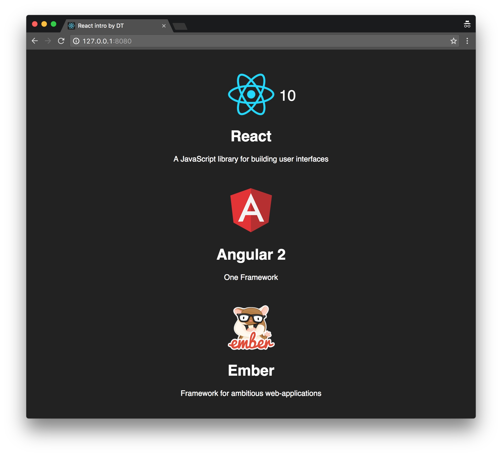

# react-intro

**Used:** HTML5, CSS3, JSX, ReactJS, ReactDOM, Babel  

React предоставляется в виде библиотеки JavaScript с компилятором JSX и связанных с ними инструментов разработки. React облегчает создание многоразовых быстродействующих компонентов представления, которые можно использовать для создания современных веб-интерфейсов.

